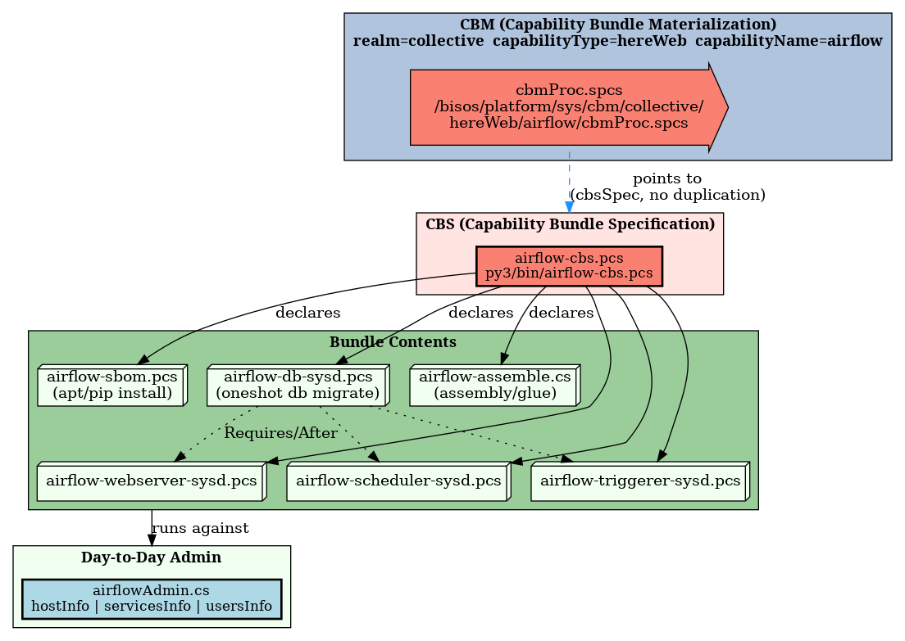

#+title: bisos.airflow: Apache Airflow platform management via BISOS Capability Bundles
#+DATE: <2026-08-11 Tue>
#+AUTHOR: Mohsen BANAN
#+OPTIONS: toc:4

#+BEGIN: b:org:pypi:readme/topControls :pkgName "airflow" :comment "basic"

|----------------------+------------------------------------------------------------------|
| ~Blee Panel Controls~: | [[elisp:(show-all)][Show-All]] : [[elisp:(org-shifttab)][Overview]] : [[elisp:(progn (org-shifttab) (org-content))][Content]] : [[elisp:(delete-other-windows)][(1)]] : [[elisp:(progn (save-buffer) (kill-buffer))][S&Q]] : [[elisp:(save-buffer)][Save]]  : [[elisp:(kill-buffer)][Quit]]  : [[elisp:(bury-buffer)][Bury]] |
| ~Panel Links~:         | [[file:./py3/panels/bisos.airflow/_nodeBase_/fullUsagePanel-en.org][Repo Blee Panel]] --  [[file:/bisos/git/auth/bxRepos/bisos-pip/airflow/py3/panels/bisos.airflow/_nodeBase_/fullUsagePanel-en.org][Blee Panel]]                                   |
| ~See Also~:            | [[https://pypi.org/project/bisos.airflow][At PYPI]] : [[https://github.com/bisos-pip/pycs][bisos.PyCS]]                                             |
|----------------------+------------------------------------------------------------------|

#+END:

* Overview

/bisos.airflow/ is a BISOS package for managing an Apache Airflow platform ---
webserver (API server), scheduler, triggerer, metadata database, and DAG
development/testing --- as a BISOS Capability Bundle (CBS/CBM) of
=systemd=-planted Command Services.

With CBM (Capability Bundle Materialization), Airflow's five roles are
installed as independent host =systemd= units rather than one monolithic
=airflow standalone= process: a planted pointer leaf
(=cbmProc.spcs=) subprocess-invokes a Capability Bundle Specification
(=airflow-cbs.pcs=) which declares package installation (sbom), the five
=systemd= units, and the assembly step needed to bring up a working
=airflow.here= installation on a single host. This gives independent
start/stop/status and independent logs per role, without the operational
overhead of a distributed executor (Celery/Kubernetes) or containers.

Airflow runs as a dedicated =airflow= system account, not root, with
=AIRFLOW_HOME=/opt/airflow= and a PostgreSQL metadata DB, and it targets
Airflow 3. The full description is in the
[[file:./py3/panels/bisos.airflow/airflowUsage/_nodeBase_/fullUsagePanel-en.org][airflowUsage]]
Blee panel.

#+BEGIN: b:org:pypi:readme/pkgDocumentation :pkgName "airflow-cs" :comment "basic"

# PYPI Documentation Comes Here in _description.org
#+END:

* Capability Materialization

The figure below shows the top-down layering of =airflow.here='s Capability
Materialization: the planted CBM pointer leaf
(=/bisos/platform/sys/cbm/collective/hereWeb/airflow/cbmProc.spcs=) points to
(and does *not* duplicate) the CBS (=py3/bin/airflow-cbs.pcs=), which declares
the bundle of =airflow-sbom.pcs=, the 5 =airflow-*-sysd.pcs= units, and
=airflow-assemble.cs=. =py3/bin/airflowAdmin.cs= sits below all of that as the
day-to-day admin-facing CS an operator runs against the materialized
installation.

*Regenerate this figure* (after editing =py3/images/airflow-graphviz.pcs=):

: cd py3/images
: ./airflow-graphviz.pcs --format=all -i ngProcess all

* Table of Contents     :TOC:
- [[#overview][Overview]]
- [[#capability-materialization][Capability Materialization]]
- [[#the-5-systemd-units-and-db-init][The 5 systemd Units and DB Init]]
- [[#the-library-bisosairflowairflowinfo][The Library: bisos.airflow.airflowInfo]]
- [[#installation][Installation]]
  - [[#installation-with-pip][Installation With pip]]
  - [[#installation-with-pipx][Installation With pipx]]
- [[#usage][Usage]]
  - [[#day-to-day-admin-airflowadmincs][Day-to-Day Admin: =airflowAdmin.cs=]]
  - [[#direct-airflow-cli-cheat-sheet-quickairflowcs][Direct Airflow CLI Cheat Sheet: =quickAirflow.cs=]]
- [[#key-files][Key Files]]
- [[#part-of-bisos--bystar-internet-services-operating-system][Part of BISOS — ByStar Internet Services Operating System]]
- [[#documentation-and-blee-panels][Documentation and Blee-Panels]]
- [[#support][Support]]

* The 5 systemd Units and DB Init

Five planted =*-sysd.pcs= units live in =py3/bin/=, all delegating to the same
=airflow= CLI executable, each running a different sub-command. All five run
as =User=airflow= and read =EnvironmentFile=/etc/default/airflow=, which sets
=AIRFLOW_HOME=/opt/airflow=, the PostgreSQL connection string and the Airflow 3
API URLs. =airflow-sbom.pcs= creates the account, the directories, that file
and the metadata DB.

| Unit                             | Airflow role                  | =ExecStart= sub-command         | Type                             | Ordering                                |
|----------------------------------+-------------------------------+---------------------------------+----------------------------------+-----------------------------------------|
| =airflow-db-sysd.pcs=            | DB migration                  | =airflow db migrate=            | =oneshot=, =RemainAfterExit=yes= | =Requires=/=After=postgresql.service=   |
| =airflow-webserver-sysd.pcs=     | API server + web UI           | =airflow api-server --port ...= | long-running                     | =Requires=/=After=airflow-db.service=   |
| =airflow-scheduler-sysd.pcs=     | Scheduler                     | =airflow scheduler=             | long-running                     | =Requires=/=After=airflow-db.service=   |
| =airflow-triggerer-sysd.pcs=     | Triggerer (deferrable tasks)  | =airflow triggerer=             | long-running                     | =Requires=/=After=airflow-db.service=   |
| =airflow-dag-processor-sysd.pcs= | DAG file parsing              | =airflow dag-processor=         | long-running                     | =Requires=/=After=airflow-db.service=   |

=airflow-db-sysd.pcs= is a =oneshot= unit with =RemainAfterExit=yes=: once
PostgreSQL is up, it runs =airflow db migrate= to bring the metadata schema up
to date, then reports itself "active" without staying resident. The four
long-running units each declare =Requires=/=After=airflow-db.service=, so
systemd guarantees the migration has been attempted before any of them
starts. =airflow-dag-processor= is required on Airflow 3, which parses DAG
files in a standalone process; without it no DAG is ever registered.

All five units, together with package installation, are declared by
=py3/bin/airflow-cbs.pcs= and materialized on this host by the CBM leaf
=/bisos/platform/sys/cbm/collective/hereWeb/airflow/cbmProc.spcs= (the package
ships the same pointer as =py3/bin/cbmProc-airflow.spcs=).

* The Library: bisos.airflow.airflowInfo

The facts of the installation used to be repeated across the sbom, =airflowAdmin.cs=, the
five units, the DNS and vhost files and the generated =/etc/default/airflow=, with nothing
making them agree. They now have one source, =py3/bisos/airflow/airflowInfo.py=. It is
pure: importing it has no side effects and touches no host state.

| Fact                 | =airflowInfo= attribute                                    |
|----------------------+-------------------------------------------------------------|
| OS account           | =acctName= (=airflow=; PostgreSQL peer auth maps it to the like-named role) |
| =AIRFLOW_HOME=       | =home= (=/opt/airflow=), with =dagsDir= and =logsDir=       |
| Environment file     | =envFile= (=/etc/default/airflow=)                           |
| Python venv, binary  | =virtenv= (=/bisos/venv/py3/asc=), =binPath=                 |
| fqdn, port           | =fqdn= (=airflow.here=), =portNu= (from =bisos.banna=)       |
| Metadata DB          | =pgConnStr=                                                  |
| URLs                 | =baseUrl=, =executionApiUrl=                                 |
| Version floor        | =minVersion= (=3.0=), =pipVersionSpec= (=>=3.0=)             |
| By-hand CLI prefix   | =cliPrefix= (=sudo -u airflow env AIRFLOW_HOME=... airflow=) |

Pure generators sit next to the constants: =envFileContent()= is the text
=/etc/default/airflow= is generated with, and =sysdServiceLines()= the =User=, =Group= and
=EnvironmentFile= lines of every unit. =envFileDrift()= and =unitDrift()= compare the live
files with them. =airflowAdmin.cs -i driftCheck= runs that comparison read-only.

=/etc/default/airflow= is still written only when absent, so hand overrides survive. A
lack of a generated line in a live file is therefore reported as drift, never fixed.

The sbom, the five units, =airflow-here-dns.pcs=, =airflow-wvd.pcs=, =airflowAdmin.cs= and
=quickAirflow.cs= all read =airflowInfo=. The =.pcs= files import =bisos.airflow=, so the
package must be installed (see Installation).

* Installation

The sources for the bisos.airflow pip package are maintained at:\\
https://github.com/bisos-pip/airflow

The bisos.airflow pip package is available at PYPI as\\
https://pypi.org/project/bisos.airflow

You can install bisos.airflow with pip or pipx.

** Installation With pip

If you need access to bisos.airflow as a python module, install it with pip:

#+begin_src bash
pip install bisos.airflow
#+end_src

Package development, on a host that has the sources, is an editable install with
=pypiProc.sh=:

#+begin_src bash
pypiProc.sh -i pkgReInstall edit /bisos/venv/py3/bisos3
#+end_src

That also symlinks the commands into =/bisos/venv/py3/devbin/=, which puts them on PATH.
The install copies the scripts into the venv's =bin/= as well; those copies go stale as
=py3/bin/= changes, so run =pkgReInstall= again after changing a script.

** Installation With pipx

If you only need access to bisos.airflow on the command line, install it with pipx:

#+begin_src bash
pipx install bisos.airflow
#+end_src

The following commands are made available:

- =airflowAdmin.cs= --- day-to-day admin CS for this host's =airflow.here= installation.
- =quickAirflow.cs= --- direct-command cheat sheet for the =airflow= CLI and its =systemd= units.
- =airflow-cbs.pcs= --- Capability Bundle Specification: declares sbom + the 5 sysd units + assemble.
- =cbmProc-airflow.spcs= --- planted CBM pointer that materializes the CBS at this host.
- =airflow-sbom.pcs= --- package installation via [[https://github.com/bisos-pip/sbom][bisos.sbom]], plus the =airflow= account, =/etc/default/airflow= and the PostgreSQL metadata DB.
- =airflow-db-sysd.pcs=, =airflow-webserver-sysd.pcs=, =airflow-scheduler-sysd.pcs=, =airflow-triggerer-sysd.pcs=, =airflow-dag-processor-sysd.pcs= --- the 5 systemd units.
- =airflow-assemble.cs= --- assembly/glue step (DNS + nginx vhost).
- =airflow-here-dns.pcs= --- registers the =.here= fake-domain DNS entry (=airflow.here=).
- =airflow-wvd.pcs= --- the nginx virtual host for =airflow.here= (via [[https://github.com/bisos-pip/webCap][bisos.webCap]]).

* Usage

** Day-to-Day Admin: =airflowAdmin.cs=

Run with no arguments (or =-i examples=) to see the full menu. Key
sub-commands:

#+begin_src bash
airflowAdmin.cs -i hostInfo       # fqdn, port, AIRFLOW_HOME, DAG dir, log dir
airflowAdmin.cs -i servicesInfo   # links for operating the systemd units
airflowAdmin.cs -i dagsInfo       # list, trigger, pause, graph, parsing health
airflowAdmin.cs -i usersInfo      # list/create users; default admin/password
airflowAdmin.cs -i fullUpdate     # all of the above
airflowAdmin.cs -i driftCheck     # live env file and units against airflowInfo; read-only
#+end_src

** Direct Airflow CLI Cheat Sheet: =quickAirflow.cs=

For direct =airflow= CLI / =systemctl= / =journalctl= invocations (not routed
through =airflowAdmin.cs=), run:

#+begin_src bash
quickAirflow.cs
#+end_src

* Key Files

An overview of the relevant files of the bisos.airflow package (starting-point;
to be expanded as the package develops):

- =py3/bisos/airflow/airflowInfo.py= --- the single source of the installation's facts, the env-file and unit generators, and the drift functions.
- =py3/bin/airflowAdmin.cs= --- day-to-day admin CS (hostInfo, servicesInfo, dagsInfo, usersInfo, fullUpdate, driftCheck).
- =py3/bin/quickAirflow.cs= --- direct-command cheat sheet for the =airflow= CLI and systemd units.
- =py3/bin/airflow-cbs.pcs= --- CBS declaring the bundle (sbom + 5 sysd units + assemble).
- =py3/bin/cbmProc-airflow.spcs= --- planted CBM pointer leaf that materializes the CBS.
- =py3/bin/airflow-sbom.pcs= --- package installation via [[https://github.com/bisos-pip/sbom][bisos.sbom]], the =airflow= account and the PostgreSQL metadata DB.
- =py3/bin/airflow-db-sysd.pcs= --- oneshot DB migration unit.
- =py3/bin/airflow-webserver-sysd.pcs=, =airflow-scheduler-sysd.pcs=, =airflow-triggerer-sysd.pcs=, =airflow-dag-processor-sysd.pcs= --- the four long-running units.
- =py3/bin/airflow-assemble.cs= --- assembly/glue step (DNS + nginx vhost).
- =py3/bin/airflow-here-dns.pcs= --- =.here= fake-domain DNS registration for =airflow.here=.
- =py3/bin/airflow-wvd.pcs= --- nginx virtual host for =airflow.here=.
- =py3/images/airflow-graphviz.pcs= --- source for the Capability Materialization figure.
- =py3/tests/verify.sh= --- smoke test for =airflowAdmin.cs=, =quickAirflow.cs= and =airflowInfo=.
- =py3/setup.py=, =py3/pypiProc.sh= --- PyPI packaging (setup.py is dblock-driven; do not hand-edit).

* Part of BISOS — ByStar Internet Services Operating System

Layered on top of Debian, *BISOS* (By* Internet Services Operating System)
is a unified and universal framework for developing both internet services and
software-service continuums that use internet services. See
[[https://github.com/bxGenesis/start][Bootstrapping ByStar, BISOS and Blee]]
for information about getting started with BISOS.

*BISOS* is a foundation for *The Libre-Halaal ByStar Digital Ecosystem* which
is described as a cure for losses of autonomy and privacy in a book titled:
[[https://github.com/bxplpc/120033][Nature of Polyexistentials]]

/bisos.airflow/ is part of BISOS. It is a standalone package that can
be used independently of the full BISOS environment.

* Documentation and Blee-Panels

bisos.airflow is part of the ByStar Digital Ecosystem
[[http://www.by-star.net]].

This module's primary documentation is in the form of Blee-Panels.
Blee-Panels are in the =./py3/panels= directory. From within Blee and
BISOS these panels are accessible under the Blee "Panels" menu.

See [[file:./py3/panels/bisos.airflow/_nodeBase_/fullUsagePanel-en.org]]
for a starting point, and
[[file:./py3/panels/bisos.airflow/airflowUsage/_nodeBase_/fullUsagePanel-en.org][airflowUsage]]
for the full description of what the package does.

/bisos.airflow/ is best developed with [[https://github.com/bx-blee][Blee]], the /By* BISOS
Libre-Halaal Emacs Environment/ --- a layer on top of Emacs and BISOS
which creates a comprehensive integrated usage and development
environment.

* Support

For support, criticism, comments and questions; please contact the
author/maintainer\\
[[http://mohsen.1.banan.byname.net][Mohsen Banan]] at:
[[http://mohsen.1.banan.byname.net/contact]]

# Local Variables:
# eval: (setq-local toc-org-max-depth 4)
# End:
